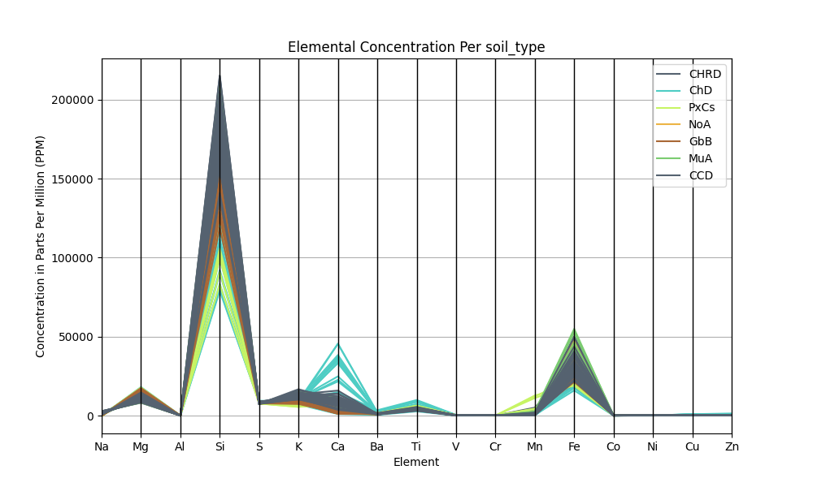

# Soil Analysis
The soil data is stored as a csv file containing the column headers in the first row and subsequent rows containing the raw data for each sample collected.

Each region was sampled 45 times for the elements Na, Mg, Al, Si, S, K, Ca, Ba, Ti, V, Cr, Mn, Fe, Co, Ni, Cu, and Zn.
The data was analyzed using various Python v3.7.2.
The Pandas Python module v1.1.4 was used to process and handle the raw data by loading the csv file into a dataframe.
Matplotlib v3.3.3 along with the Seaborn package v0.11.0 was used to visualize the data.
Scikit Learn v0.23.2 was leveraged to perform Principal Component Analysis and KMeans clustering of the data.

The packages were installed using pip and the specific modules imported into the `analysis.py` script as such

```
import pandas as pd
import matplotlib.pyplot as plt
import matplotlib.lines as mlines
import seaborn as sns
import itertools
import random

from sklearn import preprocessing
from sklearn.decomposition import PCA
from sklearn.cluster import KMeans

from sklearn.metrics.cluster import homogeneity_score
from sklearn.metrics.cluster import completeness_score
from sklearn.metrics.cluster import v_measure_score
```

The specific version of each package can be found in the `requirements.txt` file.

The analysis can be reproduced by downloading the soil dataset csv file and running `python analysis.py`.

### Descriptive Statistics
The regions are divided into the Northwest Forest (nwf), the Croton Woods (cw), Vault Hill (vh), and the Tibbets Brook Floodplain Forest (tb).
The transect and plot give the detailed location of each sample which are uniquely identifiable by there sample id, but only region level analysis was performed in this study.


The provided csv file was read into a Pandas dataframe using 

`df = pd.read_csv('vcp_soil_ppm.csv')`

Columns 4-20 in Figure x hold the measurements in parts per million (ppm) for the concentration of each element sampled.
This summary of the dataset can be created using the method `df.info()` on the Pandas dataframe.

```
[180 rows x 21 columns]
General Dataset Description
<class 'pandas.core.frame.DataFrame'>
RangeIndex: 180 entries, 0 to 179
Data columns (total 21 columns):
 #   Column    Non-Null Count  Dtype  
---  ------    --------------  -----  
 0   region    180 non-null    object 
 1   transect  180 non-null    object 
 2   plot      180 non-null    object 
 3   sample    180 non-null    object 
 4   Na        180 non-null    float64
 5   Mg        180 non-null    float64
 6   Al        180 non-null    float64
 7   Si        180 non-null    float64
 8   S         180 non-null    float64
 9   K         180 non-null    float64
 10  Ca        180 non-null    float64
 11  Ba        180 non-null    float64
 12  Ti        180 non-null    float64
 13  V         180 non-null    float64
 14  Cr        180 non-null    float64
 15  Mn        180 non-null    float64
 16  Fe        180 non-null    float64
 17  Co        180 non-null    float64
 18  Ni        180 non-null    float64
 19  Cu        180 non-null    float64
 20  Zn        180 non-null    float64
```

There are 180 non null entries in total which match the number of samples collected and measured.
This dataset therefore can be said to have 180 datapoints each with 17 numerical features and 4 descriptive labels.
In this study each of the 4 regions will be compared and contrasted using element composition and the correlation of elements within each region.
A broad overview of statistics for the entire dataset is also analyzed to provide insight into the individual characteristics of each element.
The highest average concentration of elements accross all sites was of silicon (162,051 ppm) and iron (31,078 ppm).
Aluminum (3 ppm) and cobalt (25 ppm) were the elements with the lowest average concentration accross all regions.

TODO: Any speculation as to why these elements are concentrated as such? more silicon and iron is this expected?

The complete breakdown of statistics for each element in the dataset can be found in Figure x.

```
                Na            Mg          Al             Si            S  \
count   180.000000    180.000000  180.000000     180.000000   180.000000   
mean   1101.007274  12132.487882    3.068844  162051.079607  7855.029377   
std     724.544757   2318.695823    0.482190   29729.546405   465.544185   
min    -508.411700   8099.008160    1.435630   78952.344680  7194.559470   
25%     584.663127  10373.846767    2.769082  146722.686125  7511.008855   
50%    1012.834400  11857.072045    3.077606  167518.089400  7737.765955   
75%    1618.803772  13614.821383    3.361886  181297.825225  8061.059775   
max    2818.509530  18088.716750    4.957717  215358.753900  9369.779190   

                  K            Ca           Ba           Ti           V  \
count    180.000000    180.000000   180.000000   180.000000  180.000000   
mean   10813.282653   8002.330875  1189.625992  4719.168235  162.387222   
std     2118.892400   7813.202305   400.386059   953.951702   68.049288   
min     5463.809610    976.421910   418.973124  2660.864710  -13.453805   
25%     9311.399040   3916.672990   947.215025  4192.900558  116.589469   
50%    10478.258590   6155.832385  1105.607579  4534.223505  155.628452   
75%    12266.201937   8478.934090  1300.355000  5135.185385  198.075475   
max    16696.012740  45469.269500  3387.880962  9869.866740  430.856009   

               Cr            Mn            Fe          Co          Ni  \
count  180.000000    180.000000    180.000000  180.000000  180.000000   
mean    63.482892   1326.906435  31078.571850   25.483146   49.494488   
std     16.274243   1632.883224   7491.401488    5.036103   15.179858   
min    -12.245582     49.986346  15937.687030   12.707727   -1.798847   
25%     55.469601    547.109999  25903.509178   22.573605   38.982259   
50%     65.248698    967.319192  30250.111995   25.030128   48.335646   
75%     73.044311   1505.364815  34423.850740   28.183969   59.079205   
max     96.480604  12727.966900  54920.520290   39.431235   90.693063   

               Cu           Zn  
count  180.000000   180.000000  
mean   180.255026   299.005147  
std    144.472118   153.855002  
min    -10.125255   143.451616  
25%    115.967538   236.984295  
50%    143.255809   254.744146  
75%    182.190312   295.190591  
max    974.460895  1211.514519  

```
This table of descriptive statistics was generated using the `df.describe()` method in Pandas.

Histograms of the raw data can be found in the Appendix.


It can be seen in Figure X above that differences in each element concentration exist accross each individual region.
For example calcium and titanium are more prevelant in the Northwest forest, but contain less iron and silicon in comparison to the other regions.

TODO: Any speculation as to why this is?

### Element Correlation

The Pearson correlation coefficient can be used to describe the linear relationship between two independant variables.
It value ranges from -1 to 1 with -1 being total negative linear correlation and +1 being total positive linear correlation.
Positive linear correlation describes the relationship between two variables in which if the value of one increases, so does the other.
When a negative linear correlation exists between two variables, it implies that as one variable increases the other decreases.
A correlation of zero implies that no correlation exists between the two variables, or one variable can not be used to predict the other.
Uncorrelated variables are useful for classification and regression analysis as they contain the least redundant information. 

The Pearson correlation coefficient is often used for assessing the linear relationship between independantly distrubuted normal variables in biological statistics [1][2].


The results of calculating this coefficient for each combinational pair of elements for the Vancortdlant park soil study results in the following heatmap.

```
# Determine the correlation of the dataframe
correlation = df.corr()

# Plot the correlation heatmap
sns.heatmap(round(correlation, 2), annot=True, cmap="coolwarm", fmt=".2f", linewidth=.03)
plt.show()
```

Inspecting the correlation heatmap for the entire dataset in Figure X shows that there is only one element pair that is strongly correlated when analyzing the entire set of raw samples.


Strong correlation in this study refers to correlations with magnitudes greater than 0.90.
Sodium (Na) and Magnesium (Mg) show a strong negative linear correlation for the complete dataset.
This relationship can be shown to be strong accross each region as well when inspecting each region independantly of one another as shown in Figures A, B, C, and D.
No other element shows strong correlation, although the Copper (Cu) - Zinc (Zn) and Cadanium (Ca) - Zinc (Zn) element pairs have high correlations at 0.89.

The Cu-Zn pair is only strongly positively correlated in one region, the Northwest Forest (nwf).
Each of the other three regions show weak or mild correlation; vh (0.56), cw (0.27), and tb (0.10).
It can therefore be inferred by visual inspection of the correlation heatmaps that highly correlated pairs of elements can potentially be used for distictly classifiying each region.
Each region has its own unique pair of highly correlated elements as shown in Figures, A, B, C, and D.


As discussed the nwf region has a high positive linear correlation amongst the Cu-Zn element pair in which no other region has a signigicantly strong correlation.
The CW region has a uniquely high correlation between Titanium (Ti) and Nickel (Ni) at 0.93.
Both the VH and TB regions have strong positive correlations to iron (Fe) and Cobalt (Co) although they also each have uniquely strong correlated pairs in Mn-Co at 0.91 for the Tibbetts brook floodplain forest and AL-K at 0.92 for the Vault Hill region.

It would seem from even this preliminary analysis that uniquely strong positive correlation pairs between each region can be useful for classification of the respective regions.


### Principal Component Analysis
Principal Component Analysis (PCA) is a useful data reduction tool that creates orthogonal linear combinations of features to create new dimensions for the underlying dataset.
This can be used to remove elements which are highly correlated and therefore provide redundant information to the dataset.
This data reduction can also be useful for visualizating underlying dataset relationships and provide performance improvements during future processing steps such as KMeans clustering.
PCA can also provide insight into which feature groups are used to make up each new dimension. [3]

Although there are many element pairs which show only slight to moderate correlation, it is still useful to reduce the amount of redudant information stored in each variable by analyzing 
the amount of variance each element explains in the dataset.

The explained variance of each principal component that is created can be used to show the amount of dimensionality reduction that can be performed on the initial feature set.
The overall goal in PCA is to retain as much of the variance in the data as possible (>90%) using the least number of principal components.
PCA has been used to previously analyze soil for identifying the pollution levels in soils [4], determining the background element for calculating the geoaccumulation index score of soils [5]+[6], and observing elements within soil compositions [3].


Calulcating the Principal Components can be accomplished using the Python SciKit Learn Library 

```
pca = PCA() 
components = pca.fit(X)
```

where `X` is a subset of the original dataframe that includes all of the soil features.
The features are scaled using the `StandardScaler` method of the SciKit Learn preprocessing library which removes the mean and scales the features according to the unit variance.
This is an important step in the preprocossing of the data to ensure all features share the same unit relation to one another.

`X = preprocessing.StandardScaler().fit_transform(df.loc[:,df.dtypes == 'float64'])`

Once the dataset has been split into orthogonal components using PCA, the resulting variance of the new components can be shown on a histogram

```
n = [x for x in range(1, pca.n_components_+1)]
plt.bar(n, pca.explained_variance_ratio_, color="black")
plt.xticks(n)
plt.show()
```

The minimal amount of Python code needed for graphing the results of PCA are shown here. Full code can be found in the Appendix.


```
Explained Variance Percentage of Each Principal Component

PC-1: 32.23%
PC-2: 26.23%
PC-3: 12.73%
PC-4: 10.69%
PC-5: 7.34%
PC-6: 2.95%
PC-7: 2.25%
PC-8: 1.58%
PC-9: 0.95%
PC-10: 0.82%
PC-11: 0.67%
PC-12: 0.52%
PC-13: 0.39%
PC-14: 0.34%
PC-15: 0.19%
PC-16: 0.08%
PC-17: 0.05%
```

It is shown in Figure X. that in order to preserve around 90% of the explained variance of the original dataset, the first five principal components must be used.
The first five components account for 89.22% of the total explained variance.
This represents a reduction in dimensionality of 12 dimensions of the data from the original 17 features down to just 5 features.

Factor loadings describe the weighting on each linear combination of elements that is created from performing PCA.
Each principal component represents a linear combination of orthogonal features from the original dataset.
The factor weightings of these linear combinations of elements are shown in Figure X.


As the Na-Mg correlation showed a highly negative linear relationship in the previous correlation heatmaps for each region, it provides little information for distinguishing between 
each region.
The overall total concentration for each region also varys only slightly.
It is therefore expected that this combination of does not provide much insight into the overall dataset and will not have a significant factor weighting in a majority of the principal components.
This is verified in Figure X. as both Na and Mg are the most highly weighted elements in the 16th principal component which explains only 0.08% of the variance.

Observing the highest weights (>0.35) on the first 5 factor loadings shows each component is made up of unique elements.
These elements all have relationships to one another at an atomic level as described on the periodic table of elements.
Using the table as a guide can provide insight into the weightings of each component.
Looking at the first five components shows that the first principal component is mainly made up of S (0.37) and Cu (0.37). (non-metal and transition metal)
The second component is made up of Al (-0.36) and Ni (-0.38). (post transition metal and transition metal)
As the weightings of each element are low in the second component, this vector potentially represents the null vector with some noise. 
The third component is made up of mostly Cr (-0.38), Mn (0.47), and Co (0.42). (transition elements 24,25,27)
The fourth component is made up of mostly Mn (0.45), Ca (0.40), and Zn (0.36). (transition metal, Akaline earth metal, transition metal)
The fifth component is made up of mostly Al (0.42), Ti (0.38), Fe (-0.49), and Co (-0.42) (post transition metal, transition metal, transition metal, transition metal)


Interpreting the weights assigned to each principal component requires domain expertise and is sometimes not possible.
TODO: Try and explain these weightings in more detail. The following is speculation using the periodic table of elements to draw basic conclusions.

All components do have a transition metal as one of the most heavily weighted components along with a unique element class.
Weights can be positive or negative to show both positive and negative underlying correlations.
The first component can be considered the non-metal weighting, the second the negative post-transition metal weighting, the third comprising middle transition elements,
The fourth a combination of akaline earth metal and transition metal, and the fifth the positive post transition metals.

### K-Means Clustering
K Means clustering is an unsupervised machine learning technique used to group similar data points.
Each data point is groupped into a cluster by there means.
In this scenario the clustering of the data is performed to analyze if relationships exist between the various ecosystems of Van Cortlandt Park
and the underlying soil composition.
As a result, the models and clusterings are not generalized to other locations, but rather are used to provid a relative comparision of each of the four regions.

The inertia of centroids between clusters is a measure of the root square mean, which ideally is minimized between each independant cluster.
Although we assume there are four regions under consideration for the majority of this study it is shown in the Figure X below that the ideal number of clusters is around seven when using
the raw dataset and features.
As there are 7 different soil types spread out accross the various ecological regions, it is possible that the characteristics of these soil types outweigh any ecological factors.
This number of clusters is determined by observing where the inertia plot turns at the "elbow" and further clusters do not drastically improve performance of the clustering mechanism.
This inertia clustering relationship is shown in Figure X below


There are a variety of metrics that can be used for measuring the performance of clustering algorithms.
KMeans clustering commonly uses the metrics of completeness, homogeneity and V score to gauge its performance.
The completeness of a cluster is determined by the how many members of a given class are placed in the same cluster.
The homogeneity of a cluster means that all observations with the same class label are placed in the same cluster.
An overall relationship between the completeness and homogeneity of a cluster can be determined using a combination of the two measurements weighted by a beta factor and is known as the V score.[7]+[8]

```
v = (1 + beta) * homogeneity * completeness
     / (beta * homogeneity + completeness)
```

Both homogeneity and completeness range from 0 to 1, with 1 being the ideal.
The results for running KMeans clustering on the raw dataset with n=4 clusters are

Homogeneity Score: 0.265 \
Completeness Score: 0.290 \
V Score: 0.277 

As the dimension of the feature set is larger than three it is difficult to visualize the result of clustering.
Overall the performance of the KMeans clustering is not perfect as the V score shows a value less than one.

##### PCA KMeans
The first five principal components were analyzed as they comprise 89.22% of the variance for the entire dataset.
The first two components make up 32.23% and 26.23% and can be graphed in a 2 dimensional scatter plot.

TODO make this 3d plot to account for more variance...

Again inertia was calculated and it is shown that using PCA the ideal number of clusters is still seven.


The scatter plot is created of the first two principal components...


The performance of n=4 clusters using PCA is also not very accurate based off of the V score, which reflects the underlying homogeneity and completeness of the classification.

```
PCA KMeans Performance (5 components) \
Homogeneity Score: 0.258 \
Completeness Score: 0.304 \
V Score: 0.279
```

It is shown that the approximately the same amount of performance for KMeans clustering can be obtained using only the first 5 components will getting around the same
homogeneity, completeness and V score as the complete dataset.
This is significant in that it shows most of the information is preserved in PCA while greatly reducing the amount of data required to perform the analysis.
Increases the number of Principal components does marignally increase the performance of the KMeans clustering, but at the expense of visualizing the results and decreased computational performance.
The results of KMeans clustering using all PCA components is shown below

Again with n=4 clusters produces slightly better results when using all PCA components.

```
PCA KMeans Performance (All Components) \
Homogeneity Score: 0.274 \
Completeness Score: 0.298 \
V Score: 0.285
```

### Soil Type Analysis
The inertia plots above show that the ideal number of clusters from the data is somewhere between four and seven, observed using the elbow method.
It is noted in the descriptive statistics section that there are 7 soil types.
As the four ecological regions were used as labels to classify the dataset, the soil type was also inspected and the results follow.



Figure X shows that iron and silicon are the most prevelant elements across all soil types.

Figure X shows the first two principal components of KMeans clustering in a two dimensional scatter plot.
The first five principal components were used to perform the clustering.
For ease of visualization only the first two dimensions are shown here.
Seven clusters were choosen to represent the different soil types.

It is no surprise that the same data characteristics present in the underlying soil types are similar to that of the broader regions. ??
The anthropogenic impact on the soil is low and is reflected in the enrichment scores calculated, previously. ??
If there was a large impact in certain regions, it would be shown in the higher amounts of trace elements across specific regions when compared to similar soil types elsewhere. ??
(TODO: think more closely on relationship between elements in different soil types and regions, possibly remove above)


The performance of the KMeans clustering algorithm improved slightly, as indicated by the increased V score.
This was true for both clustering performed on the original dataset and on the PCA transform set.

```
KMeans Raw Data Performance (soil_type)
Homogeneity Score
0.3844976351123592
Completeness Score
0.4020805261259705
V Score
0.39309255974455154
Enter the number of pca_components to include: 5

PCA KMeans Performance
Homogeneity Score
0.36671399306333796
Completeness Score
0.39092735167064535
V Score
0.378433756619111
```

The results of the KMeans clustering shown by visual insepection of the scatter plot above, shows there are distinct clusters even using just the first two principals components.
As some of the soil types have only a small number of samples, it may be worth considering there removal to improve classification further.
These results are the most general in that they include each type of soil collected for this research.

### Conclusion
The sampling and measurement of soil element concentrations accross Van Cordtlant Park performed in this study show the relationship between each element within the observed regions as well as the ability to classify these regions based on there soil characteristics.
Through the use of correlation matrices and descriptive statistics it has been shown that although each region contains unique elemental concentrations, although some elements are more prevalant than others in any given region.
Each region contains uniquely correlated pairs of elements which can be correlated accross each independant region as well as the entire sample set.
The use of principal component analysis provides a reduction in the overall features of the dataset while maintaining a high amount of variance in the original dataset for visualizing element relationships accross regions.
KMeans clustering using the raw dataset as well as principals components was also compared and demonstrates the tradeoff between feature reduction and unsupervised clustering.
Namely the reduction in features allows for more comprehensive visualizations of clusters with a slight hit to the performance of the KMeans classifier.
The underlying soil types were also compared and it was observed that they can more accurately be used for classification than the larger regions which represent different ecosystems within the park.


### References
[1] https://www.sciencedirect.com/topics/mathematics/pearson-correlation-coefficient \
[2] https://www.ncbi.nlm.nih.gov/pmc/articles/PMC6926743/ \
[3] "Discrimination of management effects on soil parameters by using principal component analysis: a multivariate analysis case study" Sena. Frighetteo. Valarini. Tokeshi. Poppi. \
[4] "Assesment of Soil heavy Metail Pollution with Principal Component Analysis and GeoAccumulation index". Zhiyuan. Dengfend. huiping. Zhiping. \
[5] "Improved Enrichemnt fdactor calculations through principal component analysis: Examples from soils near breccia pipe uraniu, mines, Arizona, USA". Bern. Walton-Day. Naftz \
[6] "Principal component analysis as a tool to indicate the origin of potenitally toxic elemnts in soils". Boruvka. Vacek. Jehlicka. \
[7] V-Measure: A conditional entropy-based external cluster evaluation measure Andrew Rosenberg and Julia Hirschberg, 2007 (https://scikit-learn.org/stable/modules/clustering.html#homogeneity-completeness) \
[8] Identication and Characterization of Events in Social Media, Hila Becker, PhD Thesis. (https://scikit-learn.org/stable/modules/clustering.html#homogeneity-completeness) \

